## Ripples Restaurant

---

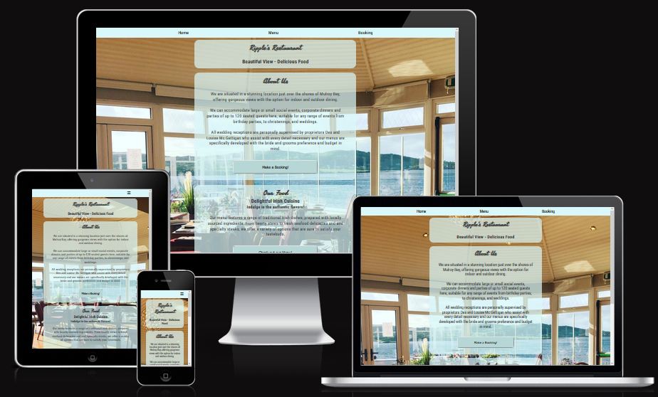

This website is for the Kerrykeel based restaurant called Ripple's Restaurant. Currently they only operate a Facebook and Instagram page. This site is targeted towards the owner of the business as a means to better promote themselves and to potential customers looking to learn more about the restauarant, what food and services they have on offer (such as perusing their menu) and how to contact and book with them.

 1. [Strategy ](#strategy)
 2. [Scope ](#features)  
 3. [Structure ](#left)  
 4. [Skeleton ](#tech) 
 5. [Surface ](#testing)  
 6. [Features ](#bugs)
    a. [Navigation](#navigation-bar)
    b. [Main Pages](#main-pages)
    c. [Footer](#footer)
    d. [Future Features](#features-left-to-implement)
 7. [Testing](#testing)
 8. [Validating](#validating)
 9. [Unfixed Bugs](#unfixed-bugs)  
 10. [Deployment](#deployment)
 11. [Credit](#credits)

## Strategy

    Users
        Users want to be able to find clear and concise information about the restaurant
        Users want to be able to view a menu for the food available
        Users want to be able to view prices
        Users want to be able to book a reservation
        Users want to be able to find and contact the restaurant for bigger occasions
        Users want to be able to order food online

    Owners
        The owners will want to show the best their restaurant has to offer
        The owners will want to advertise their appealing location and scenic views
        The owners will want to show off the quality and presentation of their food
        The owners will want to attract more users
        The owners will want the promotion from good reviews

## Scope

    The site should be consistent and clean across all pages.
    The site should include simple navigation that is consistent on all pages.
    The site should include a description of the business.
    The site should be bright and attractive.
    The site should allow users to view a menu.
    The site should allow users to book a reservation.
    The site should include a map and locaton info.

## Structure

    The structure to achieve the above scope should include at least 3 pages for simplicity's sake.
    A home page, giving a brief overview of the restuarant.
    A menu page for users to see what can be ordered.
    A booking page for users to reserve tables or events.
    Each page should be clear and concise.

    Home page  
        The home page should be a simple welcome page.
        It should include a brief introduction about the restaurant and it's services.
        It should include a blurb about the type of food on their menu.
        It should allow for easy navigation to the other pages on the site.

    Menu page
        The menu page should be clean and have a simple flow of information.
        Lunch menu options followed by Dinner menu split into the three main courses.
        The menu page should have some pictures to showcase the food to draw in the users.

    Booking page
        The booking page should consist of a simple form with the relevant information for booking.
        The form should include a Users name, contact info, time and date of reservation, and number of guests.
        The page should include contact information for booking the restaurant more fully for bigger events.
        The page should include an iframe map to show users the exact location of the restaurant.

    Each page should have a nav bar allowing users to easily navigate between pages.
    Each page should include a footer with the restaurant address and social media links.

## Skeleton

Wireframe of the three main pages in a desktop view
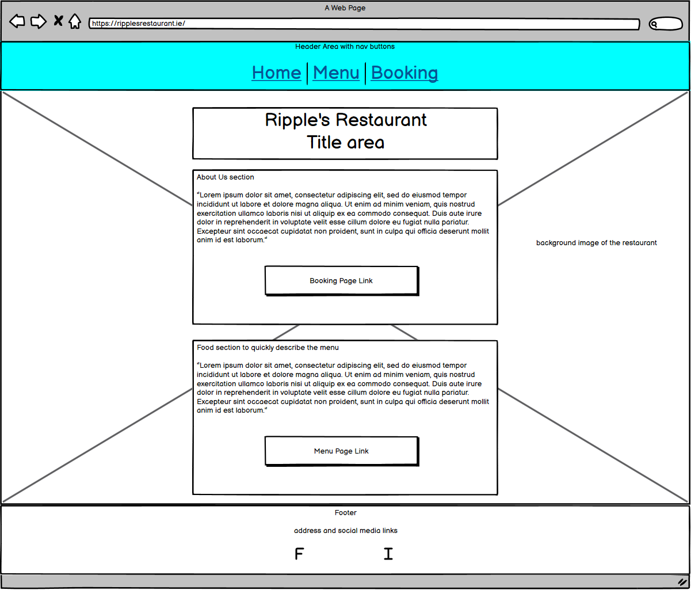
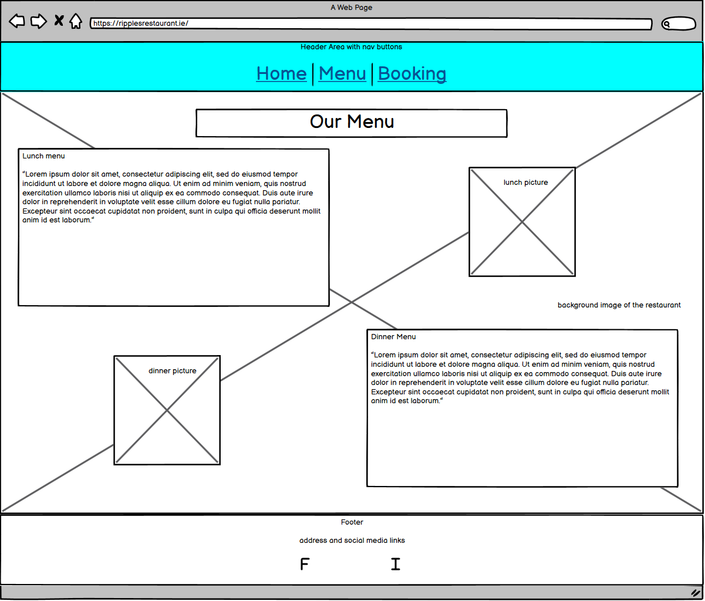
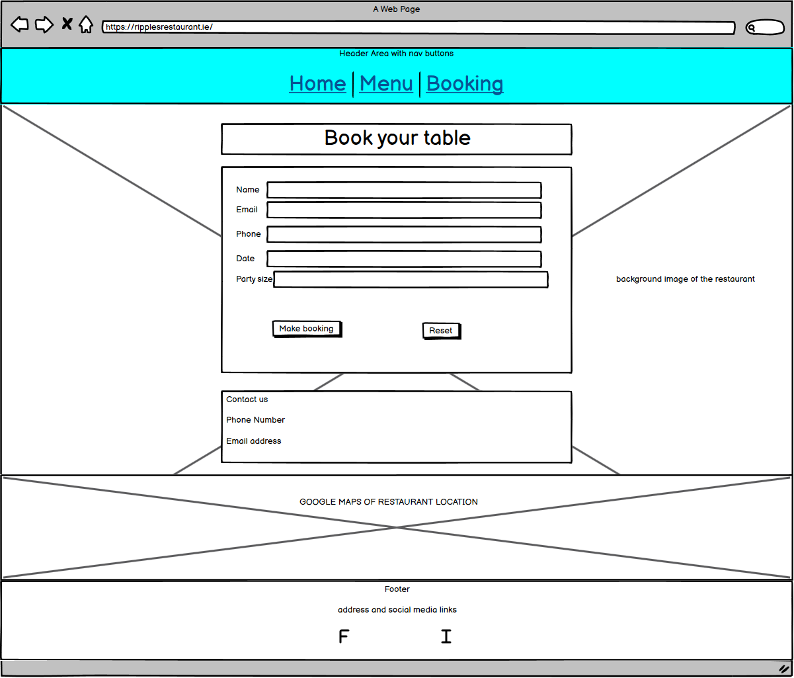
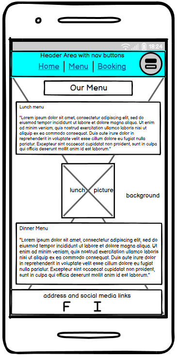

The design and flow of the website remains consistent and clean throughout all pages and devices. The only major change that is required is the positioning of image elements on the destop versus mobile view for a better user experience.

## Surface

    Presentation:
    I wanted everything on the site to be clear and bright.
    I chose a lighter blue colour to hold the header and footer elements as it reflects the waterside location the restaurant enjoys.
    I chose to mainly stick with black or white colours other than that for clear contrast for the visually impaired.
    I chose to use a sans-serif font (Roboto Condensed) for visually impaired and dyslexic users.
    I used a script font (Seaweed Script) to give the site a bit of visual flair in its text.

## Features

### Navigation Bar
    The Nav Bar
        The navigation bar works as one would expect of any website.
        Positioned at the top of the page it allows users to quickly jump from each of the three pages,
        and clearly displays which page a user is currently on.

### Main Pages

    The Home  page
        The home page includes a simple title and tagline,
        a section to give users a quick intro to the restaurant and the services it provides,
        and a section to quicly describe the type of food served.
        Both of the latter sections include a button to quickly navigate to the corresponding page.

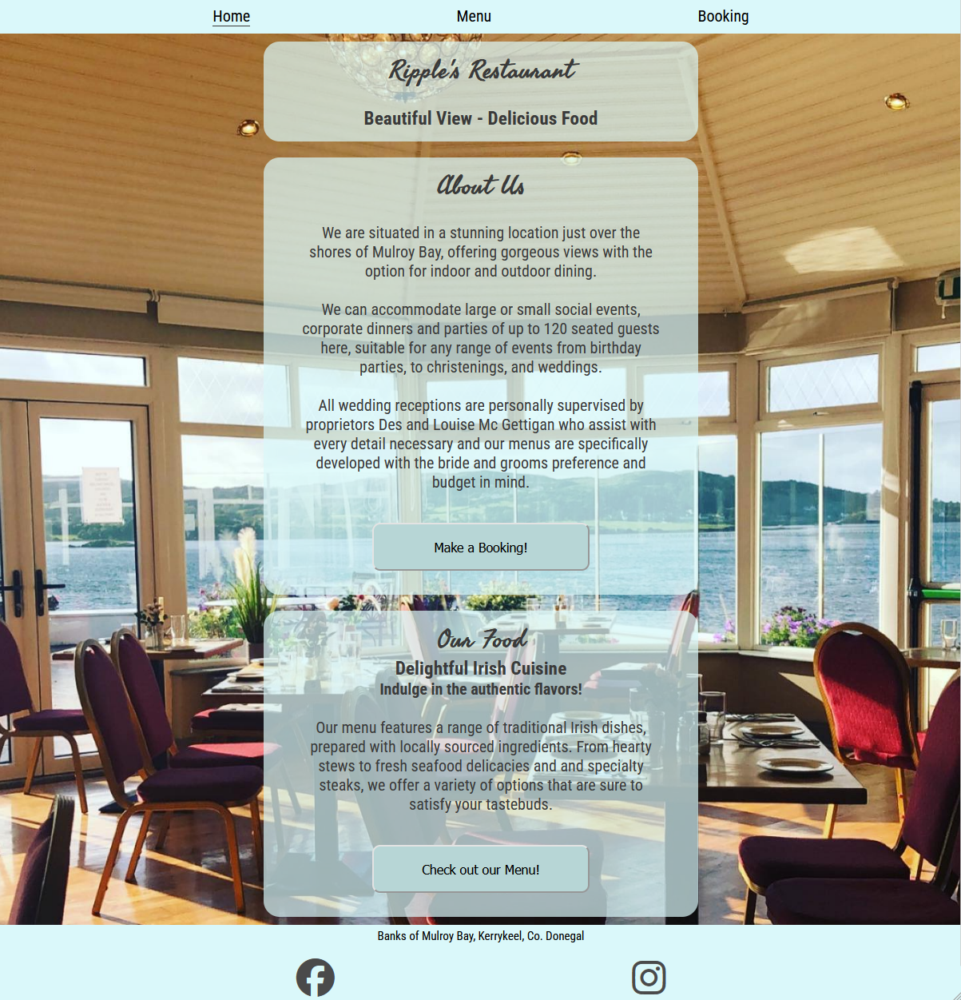

    The Menu page
        The menu page gives the users an example of the food that is available at Ripple's Restaurant.
        Most users who go to a site for a restaurant will want some idea of what is served there so I felt it vitally important to detail the various options on offer.
        Each section is clearly detailed by course as well as any additional options.

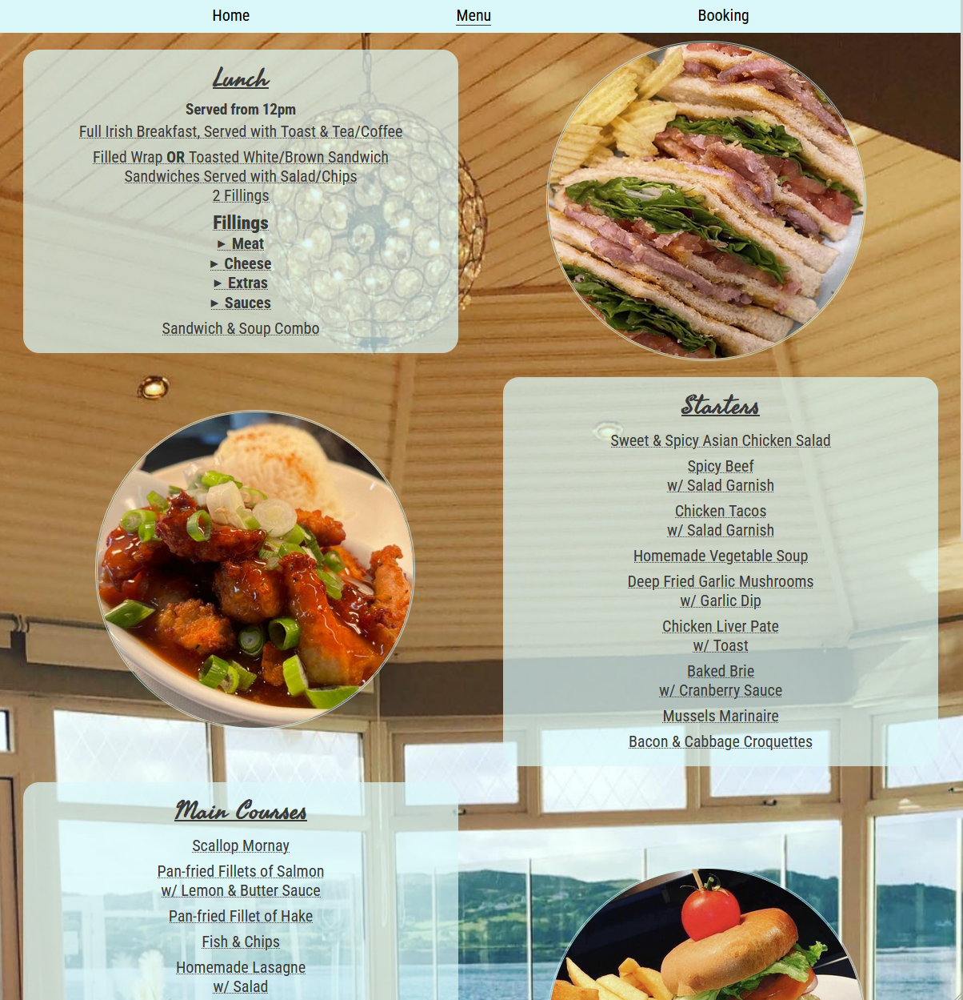

    Booking page
        This section will allow the user to use a form to book a reservation at the restaurant.
        It includes simple fields for names, number of people, times and dates, as well as email and phone numbers.
        For more complex bookings there is also the restaurants contact info included for users to reach out.
        In addition I have also included a iframe using the Google Maps API to show users the exact location of the restaurant.

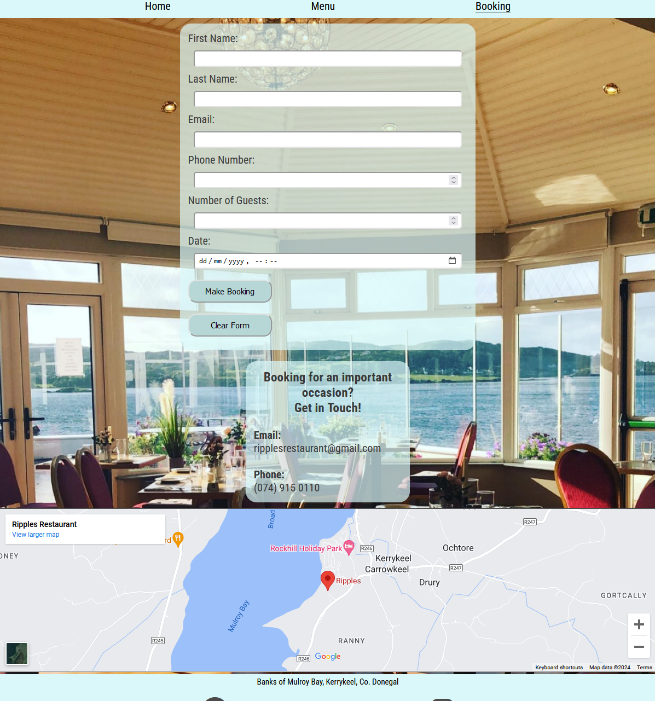

### Footer

    The footer quite simply contains the restaurants address, as well as icon links to the restaurants Facebook and Instagram profiles.
    The footer remains at the bottom of each page and is consistent across all three pages.

### Features Left to Implement

    The option to include a cart functionality for takeaway orders would be nice to include in the future.
    This would require an overhaul of the menu page to include prices and allow for more interactivity on the page to add specific items to a cart.
    In addition a cart page itself would also need to be included for the user to check their order before going through an order process.

    A reviews page is also a possible addition, allowing users of the site to quickly and easily see how well the restaurant performs and how nice their food is before committing to booking.

## Testing

The website was built for mobile platforms first and was tested to ensure all pages and sections within worked as expected.
Afterwards the site was tested for landscape phones, tablet screens, laptops, and desktops to understand how the site reacted and performed to shifting screen sizes.
The site was checked against Google Chrome's Lighthouse tester to see how it scored.

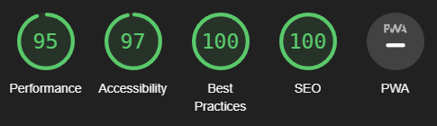
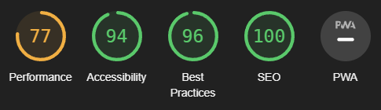
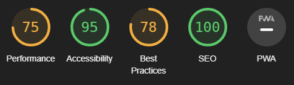

The background image of the site seems to slow the initial performance of the pages.
The iframe for the google maps lowers the best practice score due to accessing Google's API.

## Validating

    HTML
        I have run all three html pages through the validator and have made all of them fully valid.
    CSS
        I have run the css page through the validator and it is fully valid.

## Unfixed Bugs

    Currently no found bugs for all tested device sizes.

## Deployment

The site has been deployed to GitHub pages. In order to deploy the site:

    I navigated to the Settings tab of the Repository
    I navigated to the Pages menu.
    In the Source dropdown options I selected main for the branch option.
    I left the /root option as the default option.
    I saved my changes.

    GitHub deployed my website, it was live a few minutes later.

The live link can be found here - https://christopher119.github.io/Project1-Ripples-Restaurant/

## Credits

Content
    
    The text for the "About Us" section was adapted from an old review on Donegal Daily:
        https://www.donegaldaily.com/2012/04/20/heres-one-restaurant-causing-a-few-ripples-on-the-food-circuit/

    The menu items were all found on Ripple's Restaurants Facebook page: 
        https://www.facebook.com/p/Ripples-Restaurant-100046519755386

    The icons for the burger menu of the header and the socials links in the footer were taken from Font Awesome

    The method used for the mobile focused header/nav bar was adapted from the Love Running project.

    Using inline:block for buttons to adapt their height was found online:
        https://stackoverflow.com/questions/10976700/how-to-set-the-height-of-a-button-input-element-on-webkit-browsers

    Shifting the mouse cursor into a pointer finger was learned simply by inspecting websites that had that functionality:
        "cursor: pointer;"

    Had to adapt a button wrapped in a link to a form submit to pass validator testing, solution here:
        https://stackoverflow.com/questions/2906582/how-do-i-create-an-html-button-that-acts-like-a-link

    Menu page had a horizontal scrolling issue. Solution found here:
        https://stackoverflow.com/questions/17756649/disable-the-horizontal-scroll

Media

    The photos used throughout the site were all taken from Ripple's Restaurants Facebook page:
        https://www.facebook.com/p/Ripples-Restaurant-100046519755386

